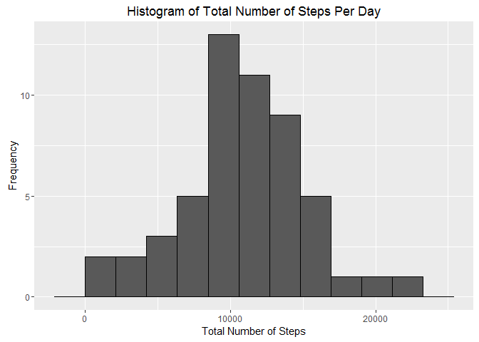
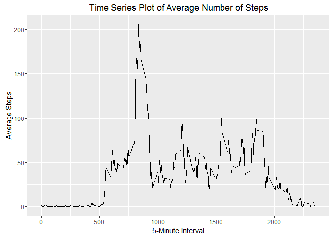
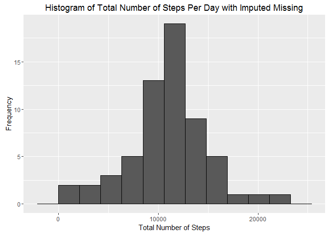
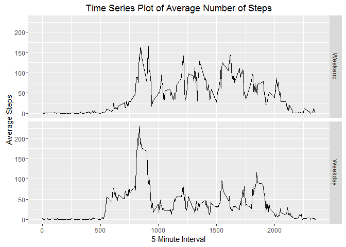

# Reproducible Research: Peer Assessment 1

## Loading and preprocessing the data

To start, the data set has to be loaded into R along with the appropriate libraries used throughout this assignment. 


```r
## Loading libraries used in assignment
library(ggplot2)
library(lubridate)

## Reading data set into R
data <- read.csv("activity.csv") 
```

A couple aggregated data sets are created in anticipation of having to find the total number of steps per day and the average number of steps during each 5-minute interval. More detailed processing of the data is done during each individual section of the assignment. 


```r
## Data set for sum of steps by date
aggsum <- aggregate(data$steps, by=list(date = data$date), sum)
colnames(aggsum)[2] <- "steps"

## Data set for average of steps by 5-minute intervals
aggmean <- aggregate(data$steps, by=list(interval = data$interval), mean, na.rm = TRUE)
colnames(aggmean)[2] <- "avgsteps"
```


## What is mean total number of steps taken per day?

The mean of the total number of steps taken per day is 9354.23 and the median is 10395. The missing values are not included in the calculations so the numbers may be skewed. 


```r
## Calculating the mean of the total number of steps taken per day
mean(aggsum$steps, na.rm = TRUE)
```

```
## [1] 10766.19
```

```r
## Calculating the median of the total number of steps taken per day
median(aggsum$steps, na.rm = TRUE)
```

```
## [1] 10765
```


```r
## Histogram of the total number of steps taken per day with missing values ommitted
ggplot(aggsum, aes(steps)) + 
        geom_histogram(bins = 10, color = "black", na.rm = TRUE) + 
        labs(x = "Total Number of Steps") + 
        labs(y = "Frequency") + 
        labs(title = "Histogram of Total Number of Steps Per Day")
```

\


## What is the average daily activity pattern?

On average, the largest amount of steps taken is during the 835th minute of the day, which equates to almost 2pm. Also from looking at the time series plot below, we can see that the steps begin to increase on average at around noon and peaks at 2pm, and decreases by 3pm. 


```r
## Time series plot of average number of steps
ggplot(aggmean, aes(x = interval, y = avgsteps)) + 
        geom_line() +
        labs(x = "5-Minute Interval") +
        labs(y = "Average Steps") +
        labs(title = "Time Series Plot of Average Number of Steps")
```

\

```r
## 5-minute interval with highest average maxinum number of steps 
aggmean[order(-aggmean$avgsteps),][1,1]
```

```
## [1] 835
```


## Imputing missing values

There are 2304 missing values in this data set. Most of the time the data is missing for the whole day, and not individual 5-minute increments. The strategy that was implemented to combat the missing values was to use the average of the individual 5-minute interval throughout the 2 months to fill in for the individual missing values. As it turns out, this method results in the mean and the median of the total number of steps taken per day being the same.


```r
## Number of missing values
sum(!complete.cases(data))
```

```
## [1] 2304
```

```r
## Creating new data set that fills in the missing values
datanew <- data
for (i in 1:nrow(data)) {
        if (is.na(data[i,1]) == TRUE) {
                datanew[i,1] <- aggmean[which(aggmean$interval == data[i,3]),2]
        }
}

aggdata <- aggregate(datanew$steps, by=list(date = datanew$date), sum)
colnames(aggdata)[2] <- "steps"

## Histogram of total number of steps per day with imputed missing values
ggplot(aggdata, aes(steps)) + 
        geom_histogram(bins = 10, color = "black") + 
        labs(x = "Total Number of Steps") + 
        labs(y = "Frequency") + 
        labs(title = "Histogram of Total Number of Steps Per Day with Imputed Missing")
```

\

```r
## Calculating the mean of the total number of steps taken per day with imputed missing values
mean(aggdata$steps)
```

```
## [1] 10766.19
```

```r
## Calculating the median of the total number of steps taken per day with imputed missing values
median(aggdata$steps)
```

```
## [1] 10766.19
```

## Are there differences in activity patterns between weekdays and weekends?

A new factor with 2 levels (weekday and weekend) is created and added to the imputed data set. A time series plot is created to compare and contrast the difference in activity patterns during weekday and weekend. Looking at the time series plots below, it seems that during the weekend the activity is more steady and consistent, while the weekdays show very high highs accompanied by low lows. 


```r
## Creating labels for week day and adding in 2 more columns to the data set to sort weekend and weekday
wkdy <- c("Monday", "Tuesday", "Wednesday", "Thursday", "Friday")
datanew$date <- as.Date(datanew$date, format = "%Y-%m-%d")
datanew$day <- weekdays(datanew$date)
datanew$daytype <- factor((datanew$day %in% wkdy), levels = c(FALSE,TRUE), labels = c("Weekend", "Weekday"))

## Creating data set with average number of steps 
aggmeanwk <- aggregate(datanew$steps, by=list(datanew$daytype, datanew$interval), mean)
colnames(aggmeanwk) <- c("daytype", "interval", "avgsteps")

## Time series plots of average number of steps, one weekend, one weekday
ggplot(aggmeanwk, aes(x = interval, y = avgsteps)) + 
        geom_line() + facet_grid(daytype~.) +
        labs(x = "5-Minute Interval") +
        labs(y = "Average Steps") +
        labs(title = "Time Series Plot of Average Number of Steps")
```

\
